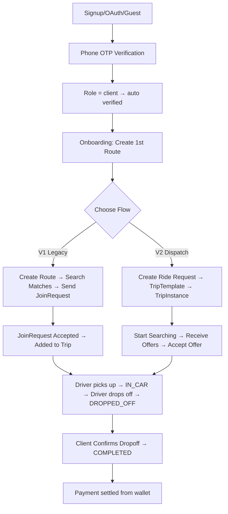
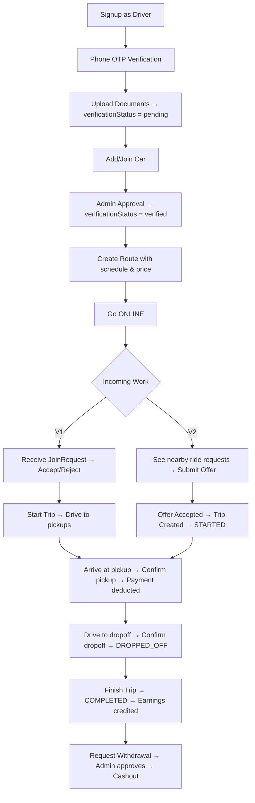
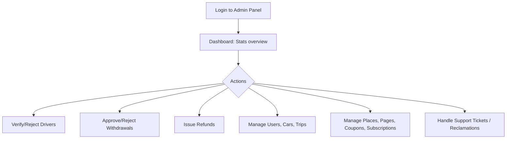
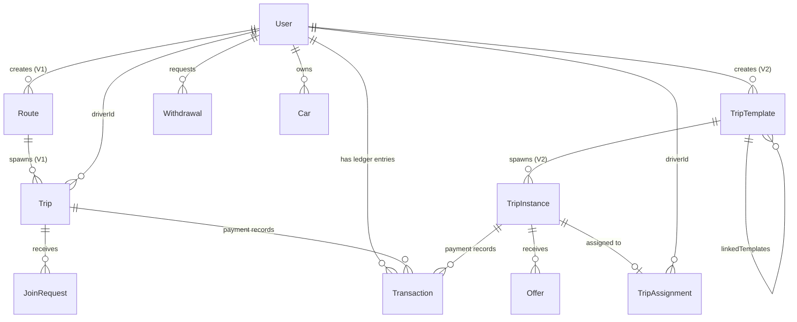
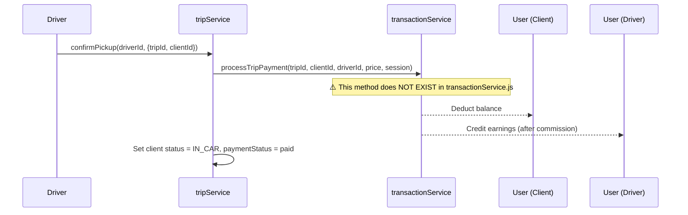
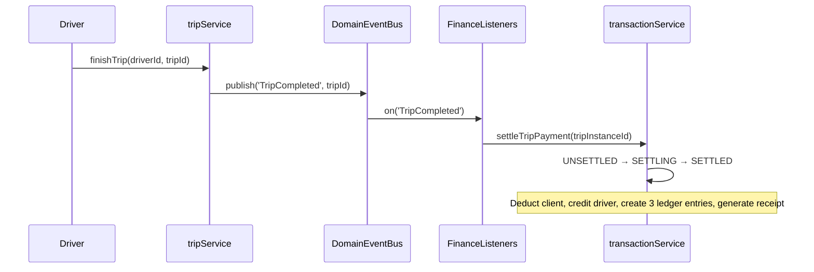

# 🔍 Master SaaS Discovery, Business Understanding & Complete Real-Life Lifecycle Audit

> **Project**: detour.ma — Moroccan Carpooling / Ride-Sharing SaaS Platform
> **Currency**: MAD (Moroccan Dirham)
> **Architecture**: Node.js Express + MongoDB (Mongoose) + Socket.io + Expo React Native + Vite Admin Panel
> **Date**: 2026-09-05

---

## 1. Complete List of Actors (Roles)

| Actor | Model Field | Description |
|---|---|---|
| **Client (Passenger)** | `User.role = 'client'` | Searches for rides, creates ride requests, pays drivers |
| **Driver** | `User.role = 'driver'` | Creates routes, receives join requests / offers, picks up & drops off passengers |
| **Admin** | `User.role = 'admin'` | Manages users, approves/rejects drivers & withdrawals, issues refunds, manages platform |
| **Guest** | `User.authProvider = 'guest'` | Limited access, device-bound identity, auto-created on guest login |
| **System (CRON)** | N/A | Automated recurring instance generation, scheduled dispatch, driver inactivity monitor |

> [!IMPORTANT]
> There is no explicit `superadmin` role. The `admin` role has full access to finance operations (approve/reject withdrawals, issue refunds).

---

## 2. Complete User Journeys (Entry to Exit)

### 2.1 Client Journey



### 2.2 Driver Journey



### 2.3 Admin Journey



---

## 3. Complete Entity Relationship Map



> [!WARNING]
> **Two parallel architectures co-exist**: V1 (Route/Trip/JoinRequest) and V2 (TripTemplate/TripInstance/Offer/TripAssignment). Both are actively served from the same server. This is the single most important architectural fact about the codebase.

---

## 4. Complete State Machines

### 4.1 V1 Legacy Route (Trip) States
[LegacyRouteStateMachine.js](file:///c:/Users/sibar/Desktop/detour.ma/detour/backend/state/LegacyRouteStateMachine.js)

```
PENDING → STARTED → ARRIVED_PICKUP → IN_PROGRESS → COMPLETED
  ↓          ↓           ↓               ↓
CANCELLED  CANCELLED   CANCELLED      CANCELLED
```

### 4.2 V1 Legacy Client States (per client within a Trip)
[LegacyClientStateMachine.js](file:///c:/Users/sibar/Desktop/detour.ma/detour/backend/state/LegacyClientStateMachine.js)

```
PENDING → WAITING → CONFIRMED → STARTING_SOON → READY → PICKUP_INCOMING → IN_CAR → DROPPED_OFF → COMPLETED
    ↓        ↓          ↓            ↓             ↓          ↓                ↓
 CANCELLED CANCELLED CANCELLED    CANCELLED     CANCELLED  CANCELLED_AT_PICKUP  CANCELLED_AT_DROPOFF
                                                           PICKUP_DISPUTED      DROPOFF_DISPUTED
```

### 4.3 V2 TripInstance States
[TripStateMachine.js](file:///c:/Users/sibar/Desktop/detour.ma/detour/backend/state/TripStateMachine.js)

```
DRAFT → SEARCHING → OFFERS_OPEN → ASSIGNED → EN_ROUTE → ARRIVED → BOARDED → STARTED → COMPLETED
  ↓        ↓            ↓             ↓          ↓          ↓         ↓          ↓
CANCELLED CANCELLED  CANCELLED     CANCELLED   CANCELLED  CANCELLED CANCELLED  CANCELLED
```

### 4.4 TripInstance Financial States
[transactionService.js](file:///c:/Users/sibar/Desktop/detour.ma/detour/backend/services/transactionService.js)

```
UNSETTLED → SETTLING → SETTLED
                    ↘ PAYMENT_PENDING (insufficient funds)
SETTLED → REFUNDED (admin force-refund)
```

### 4.5 Withdrawal States

```
pending → approved
       ↘ rejected (balance refunded to driver)
```

---

## 5. Database Models Inventory

| Model | File | Key Purpose |
|---|---|---|
| [User](file:///c:/Users/sibar/Desktop/detour.ma/detour/backend/models/User.js) | `User.js` | All actors. Contains balance, earnings, spending, stats, driverStatus, verificationStatus, subscription |
| [Route](file:///c:/Users/sibar/Desktop/detour.ma/detour/backend/models/Route.js) | `Route.js` | V1 route definition (start/end/waypoints, schedule, price). `2dsphere` indexed |
| [Trip](file:///c:/Users/sibar/Desktop/detour.ma/detour/backend/models/Trip.js) | `Trip.js` | V1 execution trip. Links driver to multiple clients. Each client has status, price, paymentStatus |
| [RideRequest](file:///c:/Users/sibar/Desktop/detour.ma/detour/backend/models/RideRequest.js) | `RideRequest.js` | V1 join request between client route and driver route |
| [TripTemplate](file:///c:/Users/sibar/Desktop/detour.ma/detour/backend/models/TripTemplate.js) | `TripTemplate.js` | V2 intent/rules. Supports IMMEDIATE, SCHEDULED, RECURRING. Has linkedTemplates for recurring carpools |
| [TripInstance](file:///c:/Users/sibar/Desktop/detour.ma/detour/backend/models/TripInstance.js) | `TripInstance.js` | V2 execution occurrence. Has financialStatus, receiptSnapshot, searchRadius. `optimisticConcurrency: true` |
| [TripAssignment](file:///c:/Users/sibar/Desktop/detour.ma/detour/backend/models/TripAssignment.js) | `TripAssignment.js` | V2 links TripInstance to a driver with agreedPrice |
| [Offer](file:///c:/Users/sibar/Desktop/detour.ma/detour/backend/models/Offer.js) | `Offer.js` | V2 driver bid on a TripInstance. Has TTL expiry via MongoDB index. `optimisticConcurrency: true` |
| [Transaction](file:///c:/Users/sibar/Desktop/detour.ma/detour/backend/models/Transaction.js) | `Transaction.js` | Append-only ledger. Types: credit/debit. Categories: earning, commission, deposit, withdrawal, refund, pickup_payment |
| [Withdrawal](file:///c:/Users/sibar/Desktop/detour.ma/detour/backend/models/Withdrawal.js) | `Withdrawal.js` | Driver cashout requests with paymentMethod and paymentDetails |
| [Car](file:///c:/Users/sibar/Desktop/detour.ma/detour/backend/models/Car.js) | `Car.js` | Vehicle registration, insurance, photos. Supports owner + assigned driver pattern |
| [ShadowValidationResult](file:///c:/Users/sibar/Desktop/detour.ma/detour/backend/models/ShadowValidationResult.js) | `ShadowValidationResult.js` | V1→V2 migration validation audit log |

---

## 6. Service Layer Inventory

| Service | File | Domain | Key Responsibility |
|---|---|---|---|
| [tripService](file:///c:/Users/sibar/Desktop/detour.ma/detour/backend/services/tripService.js) | `tripService.js` (1082 lines) | V1 Trip | Route CRUD, match search, join requests, pickup/dropoff confirmations, trip lifecycle |
| [rideService](file:///c:/Users/sibar/Desktop/detour.ma/detour/backend/services/rideService.js) | `rideService.js` | V2 Dispatch | Ride request creation, searching, offer submission/acceptance/rejection |
| [dispatchService](file:///c:/Users/sibar/Desktop/detour.ma/detour/backend/services/dispatchService.js) | `dispatchService.js` | V2 Dispatch | Find eligible drivers ($geoNear), expand search radius, accept offer (atomic) |
| [transactionService](file:///c:/Users/sibar/Desktop/detour.ma/detour/backend/services/transactionService.js) | `transactionService.js` (591 lines) | Finance | Settlement, deposit, recharge, cashout, withdrawal request/approve/reject, refund |
| [walletService](file:///c:/Users/sibar/Desktop/detour.ma/detour/backend/services/walletService.js) | `walletService.js` | Finance (Legacy) | Driver wallet view, processTripEarnings (V1), withdraw. Approve/reject deprecated → delegates to transactionService |
| [CommissionService](file:///c:/Users/sibar/Desktop/detour.ma/detour/backend/services/CommissionService.js) | `CommissionService.js` | Finance | 15% commission calculation (configurable via env) |
| [pricingService](file:///c:/Users/sibar/Desktop/detour.ma/detour/backend/services/pricingService.js) | `pricingService.js` | Pricing | Deterministic snapshot: base fare + distance + time + commission + 20% VAT |
| [authService](file:///c:/Users/sibar/Desktop/detour.ma/detour/backend/services/authService.js) | `authService.js` (520 lines) | Auth | Signup, login, OAuth (Google/Apple), guest login, OTP, onboarding status, driver verification |
| [recurringService](file:///c:/Users/sibar/Desktop/detour.ma/detour/backend/services/recurringService.js) | `recurringService.js` | V2 Recurring | Create/archive/link/unlink recurring templates, find matching drivers |
| [recurringScheduler](file:///c:/Users/sibar/Desktop/detour.ma/detour/backend/services/recurringScheduler.js) | `recurringScheduler.js` | V2 Scheduling | Daily cron to spawn TripInstances from ACTIVE recurring templates |
| [paymentProvider](file:///c:/Users/sibar/Desktop/detour.ma/detour/backend/services/paymentProvider.js) | `paymentProvider.js` | Finance | Payment gateway abstraction. Currently **sandbox-only** (always simulated) |
| [analyticsService](file:///c:/Users/sibar/Desktop/detour.ma/detour/backend/services/analyticsService.js) | `analyticsService.js` | Analytics | Driver stats (acceptance rate, completion rate), log offer/trip actions |
| [cronJobs](file:///c:/Users/sibar/Desktop/detour.ma/detour/backend/services/cronJobs.js) | `cronJobs.js` | System | Recurring generator (20:00), scheduled dispatcher (every minute), driver inactivity (every 5 min) |

---

## 7. Complete Money Flow

### 7.1 V1 (Legacy) Payment Flow — At Pickup



> [!CAUTION]
> **CRITICAL BUG**: `tripService.js` line 700 calls `transactionService.processTripPayment()` but this method **does not exist** in [transactionService.js](file:///c:/Users/sibar/Desktop/detour.ma/detour/backend/services/transactionService.js). The V1 pickup payment will throw a runtime error. The existing V1 payment path through `walletService.processTripEarnings()` is a separate method that is never called from `confirmPickup`.

### 7.2 V2 Payment Flow — At Trip Completion



### 7.3 Revenue Model

| Revenue Stream | Rate | Source |
|---|---|---|
| **Trip Commission** | 15% (default, `COMMISSION_RATE` env) | Every completed trip fare |
| **Pro Subscription** | Variable `amount` (undefined in code!) | Monthly subscription deducted from wallet |
| **20% VAT** | 20% on subtotal | Calculated in PricingService but **not charged separately** |

### 7.4 Wallet Operations

| Operation | Actor | Method | Backed by Session? |
|---|---|---|---|
| Top-up (Card) | Client/Driver | `wallet.topup` → `PaymentProvider` → `transactionService.processRecharge` | ✅ Yes |
| Deposit (Direct) | Client/Driver | `transactionService.deposit` | ❌ No session |
| Trip Payment (V1) | System | `transactionService.processTripPayment` | ⚠️ Method missing |
| Trip Settlement (V2) | System | `transactionService.settleTripPayment` | ✅ Yes |
| Withdrawal Request | Driver | `transactionService.processWithdrawalRequest` | ✅ Yes |
| Withdrawal Approve | Admin | `transactionService.approveWithdrawal` | ✅ Yes |
| Withdrawal Reject | Admin | `transactionService.rejectWithdrawal` | ✅ Yes (refunds balance) |
| Refund | Admin | `transactionService.processRefund` | ✅ Yes |
| Cashout | Driver | `transactionService.cashout` | ✅ Yes |
| Subscribe Pro | User | `transactionService.subscribe` | ✅ Yes |

---

## 8. Dual Architecture: V1 vs V2

| Aspect | V1 (Legacy) | V2 (New) |
|---|---|---|
| **Entry Point** | `tripService` | `rideService` / `recurringService` |
| **Route API** | `/api/trip` | `/api/v2/dispatch`, `/api/v2/recurring` |
| **Route Model** | `Route` | `TripTemplate` |
| **Execution Model** | `Trip` (with embedded `clients[]` array) | `TripInstance` + `TripAssignment` |
| **Matching** | `JoinRequest` (manual accept/reject) | `Offer` (bidding system with TTL) |
| **State Machine** | `LegacyRouteStateMachine` + `LegacyClientStateMachine` | `TripStateMachine` + `OfferStateMachine` |
| **Payment Trigger** | At pickup (`confirmPickup`) | At trip completion (`finishTrip` → event → settlement) |
| **Concurrency Control** | MongoDB sessions + atomic updates | `optimisticConcurrency: true` on models |
| **Scheduling** | Manual (driver creates, client searches) | Cron-based (RecurringScheduler + CronJobs) |
| **Status** | **Actively used by frontend** | **Backend built, frontend partially integrated** |

> [!IMPORTANT]
> The V1 flow uses `Route` as both intent AND execution via `Trip.routeId`. The V2 flow cleanly separates intent (`TripTemplate`) from execution (`TripInstance`).

---

## 9. API Route Map

| Mount Path | Router File | Domain |
|---|---|---|
| `/api/auth` | `routes/auth` | Authentication |
| `/api/cars` | `routes/cars` | Vehicle management |
| `/api/tracking` | `routes/tracking` | GPS tracking |
| `/api/trip` | `routes/trip` | V1 trip lifecycle |
| `/api/places` | `routes/places` | Saved places |
| `/api/rides` | `routes/rides` | V1 ride operations |
| `/api/admin` | `routes/admin` | Admin panel operations |
| `/api/admin/finance` | `routes/adminFinance` | Admin finance (withdrawals, refunds) |
| `/api/upload` | `routes/upload` | File uploads |
| `/api/transactions` | `routes/transactionRoutes` | Transaction history |
| `/api/reclamations` | `routes/reclamations` | Support tickets |
| `/api/notifications` | `routes/notifications` | Push notifications |
| `/api/chat` | `routes/chat` | In-app messaging |
| `/api/pages` | `routes/pages` | CMS pages |
| `/api/wallet` | `routes/wallet` | Wallet operations (topup, balance, withdraw) |
| `/api/analytics` | `routes/analytics` | Driver analytics |
| `/api/v2/dispatch` | `routes/dispatchRoutes` | V2 passenger dispatch |
| `/api/v2/dispatch/driver` | `routes/driverDispatchRoutes` | V2 driver dispatch |
| `/api/v2/recurring` | `routes/recurringRoutes` | V2 recurring templates |
| `/api/shadow` | `routes/shadowRoutes` | Shadow validation (migration audit) |
| `/` | `routes/health` | Health + readiness probes |

---

## 10. Real-Time Communication (Socket.io)

| Event | Direction | Purpose |
|---|---|---|
| `join_user(userId)` | Client → Server | Subscribe to personal notifications |
| `join_trip(tripId)` | Client → Server | Subscribe to trip updates |
| `driver_location_update` | Driver → Server | GPS coordinates broadcast |
| `driver_location_changed` | Server → Clients | Re-broadcast driver position on map |
| `trip_completed` | Server → Clients | Trip finished notification |
| `trip_updated` | Server → Clients | Generic trip status change |
| `trip_cancelled_at_pickup` | Server → Client | Pickup cancellation |
| `trip_cancelled_at_dropoff` | Server → Client | Dropoff cancellation |
| `client_pickup_confirmed` | Server → Driver | Client confirmed/disputed pickup |
| `client_dropoff_confirmed` | Server → Driver | Client confirmed/disputed dropoff |
| `ride:created` | Server → Drivers | New ride request available (V2) |
| `ride:cancelled` | Server → All | Ride request cancelled (V2) |
| `ride:updated` | Server → All | Search radius expanded (V2) |
| `offer:received` | Server → Passenger | New driver offer (V2) |
| `offer:accepted` | Server → Driver | Passenger accepted your offer (V2) |
| `offer:rejected` | Server → Driver | Passenger rejected your offer (V2) |

---

## 11. CRON / Scheduled Jobs

| Job | Schedule | Purpose |
|---|---|---|
| **Recurring Instance Generator** | `0 20 * * *` (8 PM daily) | Spawn tomorrow's `TripInstance` docs from active recurring `TripTemplate`s |
| **Scheduled Dispatcher** | `* * * * *` (every minute) | Flip `DRAFT` → `SEARCHING` for instances departing within 30 min |
| **Driver Inactivity Monitor** | `*/5 * * * *` (every 5 min) | Flip drivers `ONLINE` → `OFFLINE` if no heartbeat for 15 min |
| **Offer TTL Expiry** | MongoDB TTL index | Auto-delete expired offers |
| **Pre-Trip Notifications** | Custom cron (via `tripNotifications.js`) | Notify passengers of upcoming trips |

---

## 12. Onboarding Rules

### Client Onboarding
1. ✅ Create first route (required)
2. ⬜ Add 2+ saved places (optional)
3. **Completed when**: `hasRoute = true`

### Driver Onboarding
1. ✅ Upload documents (required)
2. ✅ Add or join a car (required)
3. ✅ Admin approval (required)
4. ⬜ Create a route (optional)
5. **Completed when**: `hasDocs && hasCar && isApproved`

---

## 13. Authentication Architecture

| Method | Details |
|---|---|
| **Email/Password** | bcrypt hashing, JWT (15m access + 30d refresh) |
| **OAuth** | Google (`googleId`) and Apple (`appleId`) |
| **Guest** | Device-bound `guestId`, `verificationStatus = 'unverified'` |
| **OTP** | 6-digit code via Twilio (sandbox falls back to console log), 10 min expiry |
| **Token Refresh** | Single stored `refreshToken` on User model (rotation on use) |
| **Logout** | Clears `refreshToken`, optionally removes device |

> [!NOTE]
> Access and refresh tokens use the **same JWT_SECRET**. The refresh token is stored on the User document (single-device rotation pattern).

---

## 14. Frontend Architecture

| Layer | Technology | Structure |
|---|---|---|
| **Mobile App** | Expo Router (React Native) | File-based routing under `frontend/app/` |
| **State Management** | Zustand | 19 stores under `frontend/store/` |
| **API Layer** | Axios + React Query | `frontend/services/api.ts` + `queryClient.ts` |
| **Real-time** | Socket.io Client | `frontend/services/socket.ts`, `SocketLifecycleManager.ts` |
| **Admin Panel** | Vite + React (JSX) | `admin-panel/src/pages/` with 16 pages |

### Frontend Route Groups
- `(auth)/` — Login, Signup, Role selection, OTP, Driver onboarding, Permissions
- `(client)/` — Client home, Add route, Requests, Places, Profile, Settings, Trip details, Support
- `(driver)/` — Driver home, Add route, Add car, Assign car, Cars list, Stats, Verification, Wallet, Profile, Places
- `finance/` — Wallet page (shared)
- Root — Chat, Notifications, Edit profile, Change password, Routes, Trips, Reclamations, Tasks, Modal

---

## 15. Admin Panel Pages

| Page | Purpose |
|---|---|
| `DashboardHome` | Platform overview stats |
| `Users` | User management (verify, ban, edit) |
| `Drivers` | Driver verification workflow |
| `Trips` | Trip monitoring |
| `Cars` | Vehicle registry |
| `Finance` | Financial overview |
| `Requests` | Join request management |
| `Reviews` | Rating/review system |
| `Support` | Support ticket management |
| `Chats` | Chat monitoring |
| `Places` | Places/POI management |
| `Coupons` | Promotional coupons |
| `Credits` | Credit management |
| `Subscriptions` | Pro subscription management |
| `PagesManagement` | CMS pages |
| `Login` | Admin authentication |

---

## 16. Domain Event Architecture

[DomainEventBus.js](file:///c:/Users/sibar/Desktop/detour.ma/detour/backend/events/DomainEventBus.js) — Node.js `EventEmitter` singleton with versioned event envelopes.

| Event | Publisher | Subscriber | Effect |
|---|---|---|---|
| `TripCompleted` | `tripService.finishTrip` | `FinanceListeners` | Triggers `settleTripPayment` |
| `TripSettled` | `transactionService` | (none wired) | Logs settlement |
| `PaymentFailed` | `transactionService` | (none wired) | Emits when insufficient funds |
| `WithdrawalApproved` | `transactionService` | (none wired) | Logs approval |
| `WithdrawalRejected` | `transactionService` | (none wired) | Logs rejection |
| `TripRefunded` | `transactionService` | (none wired) | Logs refund |
| `DriverLocationUpdated` | Socket handler | `DispatchListeners` | Proximity check for approaching driver |
| `DriverApproaching` | `DispatchListeners` | (none wired) | Published but never consumed |
| `RecurringTemplatesLinked` | `RecurringService` | (none wired) | Published but never consumed |

> [!WARNING]
> Most domain events are **published but have no subscribers**. The event-driven architecture is structurally in place but functionally incomplete. Notifications for `PaymentFailed`, `WithdrawalApproved`, `DriverApproaching`, etc. are never delivered to users.

---

## 17. Critical Bugs & Broken Flows

### 🔴 Severity: CRITICAL

| # | Location | Bug Description |
|---|---|---|
| 1 | [tripService.js:700](file:///c:/Users/sibar/Desktop/detour.ma/detour/backend/services/tripService.js#L700) | `transactionService.processTripPayment()` is called but **does not exist**. Every V1 pickup confirmation will crash at runtime. |
| 2 | [transactionService.js:200](file:///c:/Users/sibar/Desktop/detour.ma/detour/backend/services/transactionService.js#L200) | `subscribe()` uses undefined variable `amount` — will throw `ReferenceError`. Also returns undefined `user` variable instead of `updatedUser`. |
| 3 | [recurringScheduler.js:137-139](file:///c:/Users/sibar/Desktop/detour.ma/detour/backend/services/recurringScheduler.js#L137-L139) | References `instance` variable instead of `generatedInstance`. Will throw `ReferenceError: instance is not defined`. |
| 4 | [dispatchListeners.js:24](file:///c:/Users/sibar/Desktop/detour.ma/detour/backend/events/dispatchListeners.js#L24) | Uses `client.routeId?.startPoint?.latitude` but Route uses GeoJSON `coordinates` array format, not `.latitude`. Proximity check will always skip. |

### 🟠 Severity: HIGH

| # | Location | Issue |
|---|---|---|
| 5 | [transactionService.js:49](file:///c:/Users/sibar/Desktop/detour.ma/detour/backend/services/transactionService.js#L49) | `trip.passengerIds[0]` — settlement assumes single passenger. Multi-passenger trips only settle for the first passenger. |
| 6 | [walletService.js:23-63](file:///c:/Users/sibar/Desktop/detour.ma/detour/backend/services/walletService.js#L23-L63) | `processTripEarnings()` is **not transactional** — no MongoDB session. Non-atomic balance update + transaction creation can leave inconsistent state on failure. |
| 7 | [walletService.js:65-96](file:///c:/Users/sibar/Desktop/detour.ma/detour/backend/services/walletService.js#L65-L96) | `withdraw()` deducts balance **without a session**, creating a race window between the Transaction creation and the balance update. |
| 8 | Wallet/Finance | Two **competing withdrawal paths**: `walletService.withdraw()` and `transactionService.processWithdrawalRequest()`. Both create Withdrawal records but with different patterns. |
| 9 | [pricingService.js](file:///c:/Users/sibar/Desktop/detour.ma/detour/backend/services/pricingService.js) vs [CommissionService.js](file:///c:/Users/sibar/Desktop/detour.ma/detour/backend/services/CommissionService.js) | Commission rate is defined in **3 places**: CommissionService (15% default + env), WalletService (hardcoded 15%), PricingService (hardcoded 15%). No single source of truth. |

### 🟡 Severity: MEDIUM

| # | Location | Issue |
|---|---|---|
| 10 | [tripService.js:986-996](file:///c:/Users/sibar/Desktop/detour.ma/detour/backend/services/tripService.js#L986-L996) | `finishTrip()` directly uses `Route.findOneAndUpdate` instead of going through the repository/model pattern used elsewhere. |
| 11 | [tripService.js:1017](file:///c:/Users/sibar/Desktop/detour.ma/detour/backend/services/tripService.js#L1017) | `finishTrip()` publishes `TripCompleted` with `tripId` (a V1 Route ID), but `FinanceListeners` passes it to `settleTripPayment()` which expects a **V2 TripInstance ID**. V1 trips will fail settlement. |
| 12 | [authService.js:94-96](file:///c:/Users/sibar/Desktop/detour.ma/detour/backend/services/authService.js#L94-L96) | Clients get `verificationStatus = 'verified'` on OTP verification. But guest/OAuth clients are never asked for OTP. OAuth gets auto-verified; guests stay `unverified`. |

---

## 18. Duplicate / Competing Code Paths

| Concern | Path A | Path B | Conflict |
|---|---|---|---|
| Trip earnings | `walletService.processTripEarnings()` | `transactionService.settleTripPayment()` | Different implementations. WalletService has no session; TransactionService does. |
| Withdrawal | `walletService.withdraw()` | `transactionService.processWithdrawalRequest()` | Both active. Different error handling. |
| Withdrawal approval | `walletService.approveWithdrawal()` → throws deprecated error | `transactionService.approveWithdrawal()` | WalletService correctly redirects. |
| Deposit / Recharge | `transactionService.deposit()` | `transactionService.processRecharge()` | Two methods for the same operation. `deposit()` lacks session. `processRecharge()` has session. |
| Route creation (client) | `tripService.createRoute(role='client')` | `rideService.createRideRequest()` | V1 creates Route, V2 creates TripTemplate + TripInstance |

---

## 19. Missing / Incomplete Features (Found in Code)

| Feature | Status | Evidence |
|---|---|---|
| Real payment gateway (Stripe/CMI) | ❌ Not implemented | `paymentProvider.js` throws `'Real payment gateway not yet implemented'` |
| Pro subscription amount | ❌ Undefined | `subscribe()` uses undefined `amount` variable |
| Coupon system | ⬜ Admin page exists | `Coupons.jsx` admin page exists, no backend service |
| Rating system | ⬜ Partial | `clientEntry.driverRating` stored but no aggregation or driver-rates-client flow |
| Chat system | ⬜ Partial | Route + admin page + frontend page exist, no service layer visible |
| Dispute resolution | ⬜ Partial | States exist (`PICKUP_DISPUTED`, `DROPOFF_DISPUTED`) but no admin resolution workflow |
| Push notifications (FCM) | ⬜ Service exists | `notificationService.js` referenced but not inspected in this audit |
| Surge pricing | ❌ Stub only | `pricingService.js` has fixed rates, comment says "allows surge engines later" |
| Timezone handling | ❌ Stub only | `recurringScheduler.js` has `// Future enhancement: apply timezone offset` |
| Automatic trip completion | ❌ Not implemented | Comment in `clientConfirmDroppedOff`: "Check if all clients are completed to auto-complete trip?" |
| Daily earnings reset | ❌ Not implemented | Comment in `walletService.js`: "In a real system, you'd reset 'today' via a cron job" |
| V2 offer expiration sweeper | ⬜ MongoDB TTL | Relies on TTL index, but expired offers leave TripInstance in `OFFERS_OPEN` state forever |

---

## 20. Architecture Decisions & Patterns

| Pattern | Implementation | Quality |
|---|---|---|
| **Repository Pattern** | Used for User, Route, Car, Places. `tripRepository`, `userRepository`, `routeRepository` | ✅ Good |
| **State Machine** | 5 explicit state machines with `validateTransition()` | ✅ Good |
| **Domain Events** | `DomainEventBus` with versioned envelopes, correlationId, actorId | ✅ Good structure, ⚠️ incomplete wiring |
| **Optimistic Concurrency** | Mongoose `versionKey` on TripInstance, Offer | ✅ Good |
| **Atomic Operations** | `findOneAndUpdate` for state transitions to prevent race conditions | ✅ Good |
| **Shadow Validation** | Parallel V1/V2 validation during migration | ✅ Smart pattern |
| **Append-Only Ledger** | Transactions are `isIrreversible: true`, refunds create new entries | ✅ Good |
| **Graceful Shutdown** | SIGTERM/SIGINT handlers drain connections | ✅ Good |
| **Security** | Helmet, CORS, rate limiting, mongo sanitize, correlation IDs | ✅ Good |

---

## 21. Open Questions for Product Owner

1. **V1 vs V2 Migration**: What is the timeline and strategy for migrating V1 (Route/Trip/JoinRequest) to V2 (TripTemplate/TripInstance/Offer)? Should V1 be deprecated now or maintained in parallel?

2. **Payment at Pickup vs Completion**: V1 charges at pickup. V2 charges at trip completion. Which is the desired business behavior? Should all trips settle at completion?

3. **Multi-passenger Settlement**: V2 `settleTripPayment` only processes `passengerIds[0]`. Should each passenger pay independently? Is the amount split or does each pay full fare?

4. **Pro Subscription Pricing**: What is the monthly price for Pro subscription? The `subscribe()` method has no defined amount.

5. **Commission Source of Truth**: The 15% commission rate is hardcoded in 3 places. Should it be exclusively from `COMMISSION_RATE` env var via `CommissionService`?

6. **VAT Handling**: PricingService calculates 20% VAT but it's not factored into actual settlements. Is VAT included in the displayed price or added on top?

7. **Dispute Resolution Workflow**: When a client disputes pickup/dropoff, what should happen? Currently no admin resolution flow exists.

8. **Coupon / Promotion System**: Admin panel has a Coupons page. What are the business rules for coupon application (discount type, limits, validity)?

9. **Driver-to-Client Rating**: Clients can rate drivers, but can drivers rate clients? If so, where in the flow?

10. **Withdrawal Minimum**: `walletService.withdraw()` enforces 50 MAD minimum, but `transactionService.processWithdrawalRequest()` has no minimum. Which is correct?

11. **Guest Limitations**: What can a guest user actually do? They are `unverified` — can they create routes, request rides, or pay?

12. **Recurring Linking Business Rules**: When a passenger links to a driver's recurring template, is there a confirmation step for the driver? Currently linking is unilateral.

13. **Auto-completion**: Should the trip auto-complete when all clients reach `COMPLETED` status, or must the driver always manually finish?

14. **Real Payment Gateway**: Which payment provider will be integrated for Morocco (CMI, PayPal, etc.)? Is the sandbox sufficient for launch?

15. **Earnings Reset**: Should `earnings.today` and `spending.today` be reset daily by cron? If so, what timezone defines "daily"?

---

> [!IMPORTANT]
> This audit is **read-only**. No code was modified. All findings are derived from the actual implementation in the codebase. The critical bugs in Section 17 should be addressed before any production deployment.
